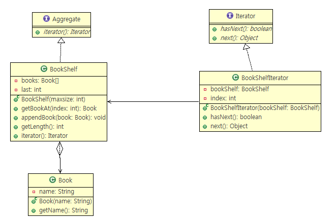
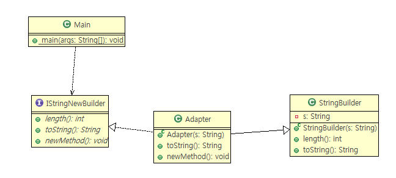
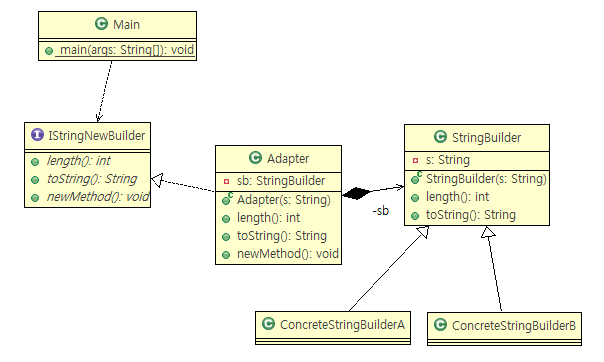
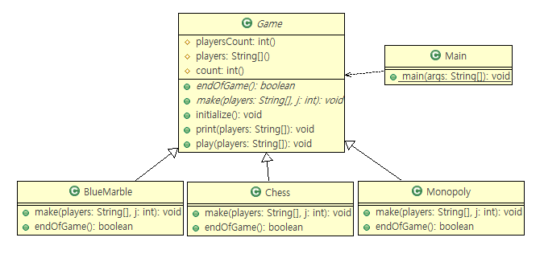

# Day1

## URL
- [www.sparxsystems.com](www.sparxsystems.com)
- [UML GoF Patterns for Java](http://www.sparxsystems.com/resources/developers/uml_patterns.html)
- [StarUML](http://staruml.io/)
- [AmaterasUML](http://amateras.osdn.jp/cgi-bin/fswiki_en/wiki.cgi?page=AmaterasUML)

\\70.12.107.90

# Degisn Pattern 23개
- 4가지만 Abstract & Super Class
1. Template Method
2. Factory Method
3. Adapter Class
4. Interpreter

## 생성 5개
- Factory Method
- Abstract Factory
- Builder
- Prototype
- Singletone

## 구조 7개 (ABCDFFP)
- Adapter
    - 인터페이스만 확대
- Bridge
    - 인터페이스, 구현쪽 확대
- Composite
- Decorator
- Proxy
    - 똑같은 인터페이스 제공
- Facade
    - 단순화시켜 심플 인터페이스 제공
- Flyweight
    - 풀링구조

## MISC (MMIISSCC TVO)

## 1. [Iterator 49p](../be_Iterator)
- 다이어그램

## 2. [Adapter 66p](../st_Adapter2Object)
- 기존 버전에서 새로운버전 나왓을때, 중간 어댑터로 끼워준다

- Adapter 1

- Adapter 2

## 3. [Template Methods 77p](../be_TemplateMethod2)
- Abstract Class 적용한 poly
- 79p LDP (The Liskov Substitution Principle)
- [Solid](https://en.wikipedia.org/wiki/SOLID_(object-oriented_design))

[다음](./day2.md)