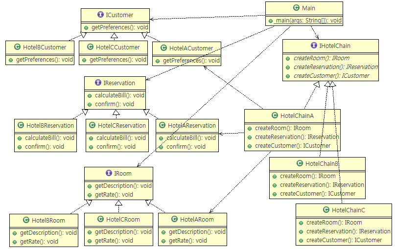
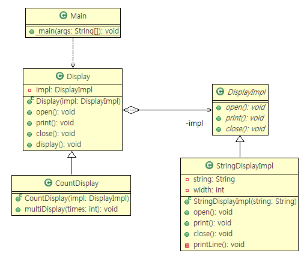
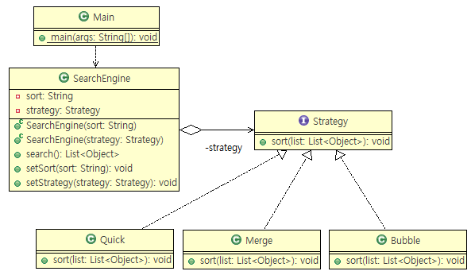

# encapsulation ?
> Class의 public한 부분이 최소가 될 수 있도록 (get, set)
1. 전체를 private로
2. 최소의 부분을 interface로
3. validation logic 작성
- Caller가 Callee 가 아닌 Interface에 dependency 를 가져감

## 4. Factory Method 89p
- Iterator, Template Method 디자인패턴이 들어있다.
- 관련 패턴 : Template Method, Singletone, Composite, Iterator

- FactoryMethod 1

- FactoryMethod 2

## 5. Singleton p99
- Singleton 1

- Singleton 2

## 6. Prototype p112
1. 종류가 너무 많아 클래스로 정리되지 않는 경우
2. 클래스로부터 인스턴스 생성이 어려운 경우
3. framework와 생성할 인스턴스를 분리하고 싶은 경우

- java.lang.Cloneable
- 원본의 복제객체를 넘긴다.

## 7. Builder p128
- 복잡한 인스턴스 조립

## 8. Abstract Factory 156p
- Factory Method Design Pattern 사용 (factoryMethod 로 구분)
- 같은 제약조건의 객체군을 만들 때
- 공장추가는 간단하지만 부품추가는 곤란
    > Adapter 패턴으로 해결가능

## 9. Bridge 172p
- 기능 계층(좌)과 구현 계층(우) 분리

## 10. Strategy 189p
- 알고리즘을 모두 바꾸기
- 위임 연결을 사용하므로 알고리즘을 용이하게 교환 가능
- State패턴과 거의 동일하지만 목적이 다르다. (알고리즘과 상태의 차이)

