# Day3


# 자바 매크로
[http://javafactory.tistory.com/963](http://javafactory.tistory.com/963)
```java
Robot r = new Robot();
r.mouseMove(200, 270);
r.mousePress(InputEvent.BUTTON1_MASK);
r.mouseRelease(InputEvent.BUTTON1_MASK);
r.mousePress(InputEvent.BUTTON1_DOWN_MASK);
r.mouseRelease(InputEvent.BUTTON1_DOWN_MASK);
```

- openCV
    - [http://blog.acronym.co.kr/570](http://blog.acronym.co.kr/570)
    - C:\opencv\build\x64\vc14\bin

- Feature Matching
    - http://blog.acronym.co.kr/579

## 11. [Composite 207p](../st_Composite2)
- 그릇과 내용물을 동일시하기
- Recursive 가능(상속하기 때문)
- Composite:Component = 1:*
    > Component 배열

- Tree Structure
- ex) File System, HTML DOM

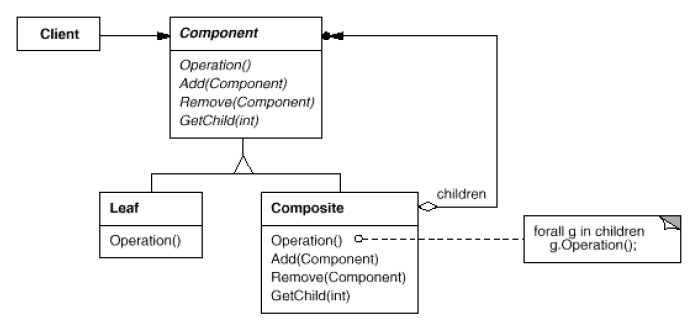

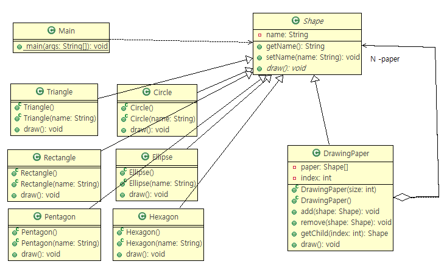

## 12. [Decorator 221p](../st_Decorator2)
- 장식과 내용물을 동일시하기
- Recursive 가능(상속하기 때문)
- Decorator:Component = 1:1

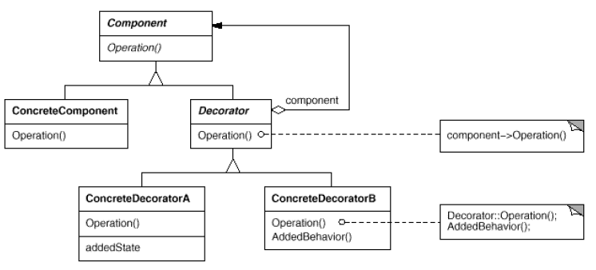

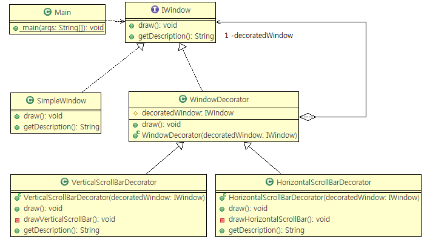

## 13. [Visitor 242p](../be_Visitor2)
- 데이터 구조를 돌아다니면서 처리하기
- 데이터 구조와 처리를 분리
- 방문하는 수만큼 메소드를 만든다.
- The Open-Closed Principle
    > 기존의 클래스를 수정하지 않고 확장할 수 있도록 하는 것

- ConcreteElement역할의 추가는 곤란
    - 필요시 Adapter 를 이용...

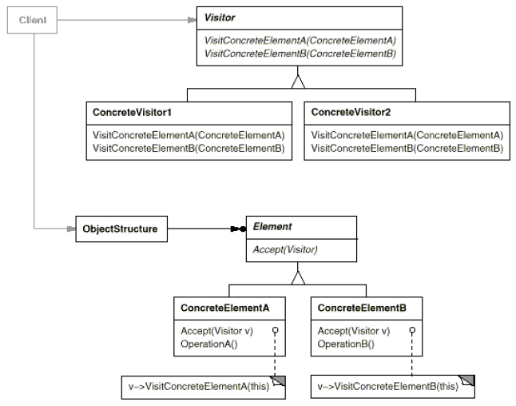

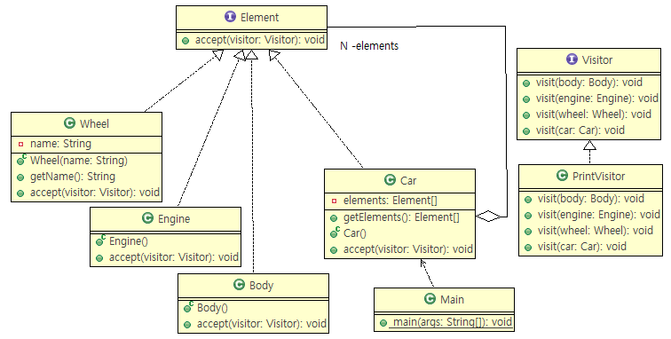

## 14. [Chain of Responsibility 262p](../be_ChainOfResponsibility2)
- 책임 떠넘기기
- 복수의 오브젝트를 사슬처럼 연결해 두면, 그 오브젝트를 차례로 돌아다니면서 목적한 객체를 결정하는 방법
- Decorator와 같지만 Concrete가 없다는 차이점

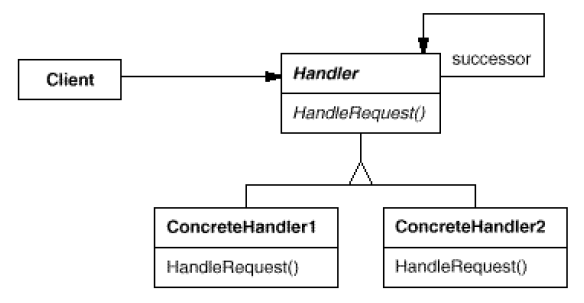

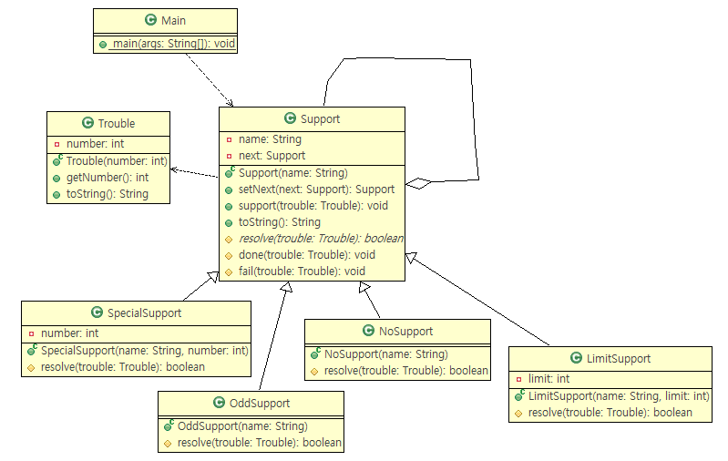

## 15. [Facade 275p](../st_Facade2)
- 단순한 창구, 단일 진입점
- 핵심은 인터페이스(API)를 적게 하는 것

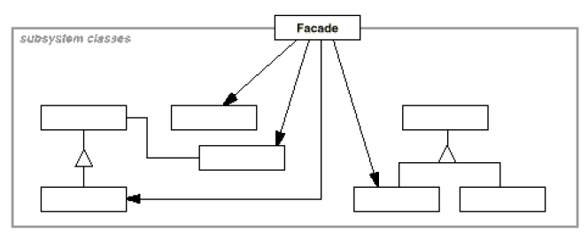

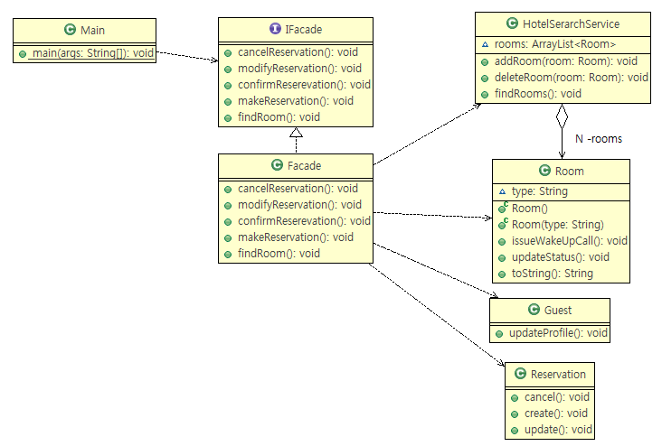

## 16. [Mediator 296p](../be_Mediator2)
- 중개인을 통해서 처리하기
- 통신 경로의 증가 때문에 중개인 사용
- 어플리케이션에 대한 의존도가 높다는 것은 재이용성이 낮다는것.

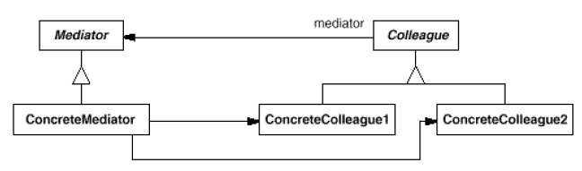

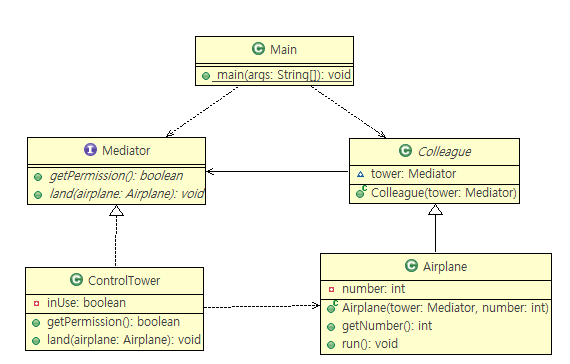

## 17. [Observer 307p](../be_Observer2)
- 상태의 변화를 알려주기
- MVC
- 관찰 대상의 상태가 변화하면 관찰자에게 알려준다.
- java.util.Observer(Interface), java.util.Observable(Class)

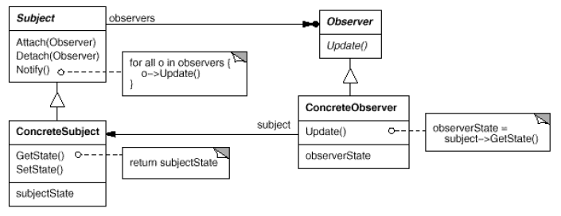

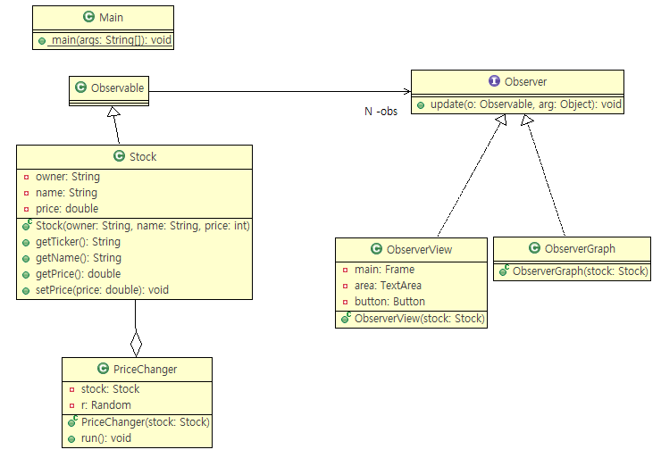

## 18. [Memento 326p](../be_Memento2)
- 상태를 저장하기
- 어플리케이션 shut down 되어도 저장
- 캡슐화에 문제가 될 수 있다.
- 패키지의 외부에서는 메멘토의 내부를 변경할수 없음.

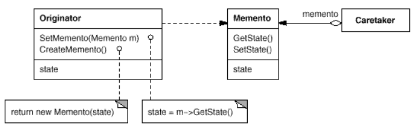

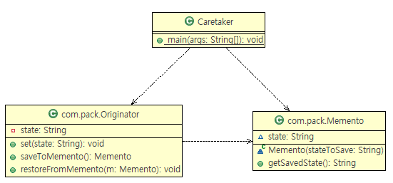


[이전](./day2.md)
[다음](./day4.md)